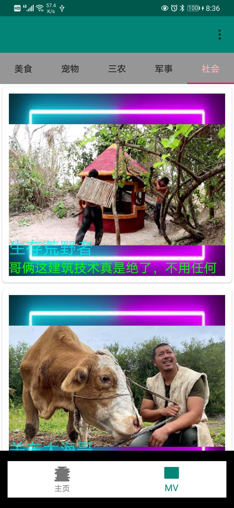

# LearnHeiMaVideoPlayer
学习黑马 kotlin android开发，制作的视频播放器

## 说明

原视频为 [2018年黑马kotlin android开发基础+实战项目](https://www.bilibili.com/video/BV1WW411z7PA?t=441&p=286)，相比于原视频，有以下变动

+ 爬取的是百度好看视频，而非音悦台，原音悦台视频都已经无法播放了。目前没有做深度爬虫，估计只能爬取20条左右
+ 没有使用IJKplayer插件，使用的是Google的ExoPlayer

## 效果

